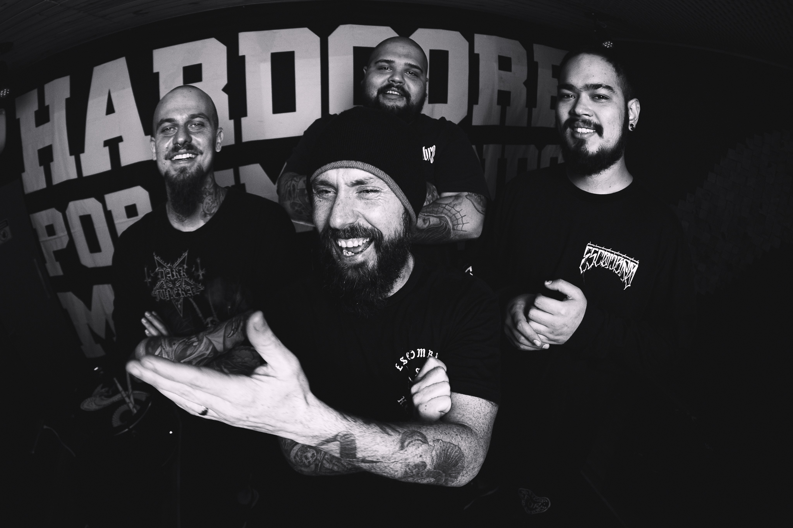

# escombro
Escombro - Eletronic Press kit

============================

Escombro
--------

Escombro é uma banda de Hardcore brasileira, fundada na cidade de São Paulo. As letras tem como principal temática os problemas enfrentados diariamente pelo povo, que sofre com a corrupção e a desigualdade causadas por praticas politicas que abusam da população. Escombro carrega a mensagem de protesto e indignação, carregando como ideal a frase hardcore por um mundo mais digno . Com grooves e refrões marcantes, o som passa, do desespero, a um suspiro de esperança. Escombro é:

*   Lucas “Jota” Ferreira - Vocal
    
*   Renato Romano - Guitarrista
    
*   Felipe “Felipeles” Luchini - Baterista
    
*   Igor Simões Fugiwara - Baixista
    

IgorFelipelesRenatoJota

### Link

texto

link

Discografia
-----------

### Link

texto

link

Video Clipes
------------

[Fazer download do MAPA DE PALCO](./assets/map_de_palco.jpeg)
